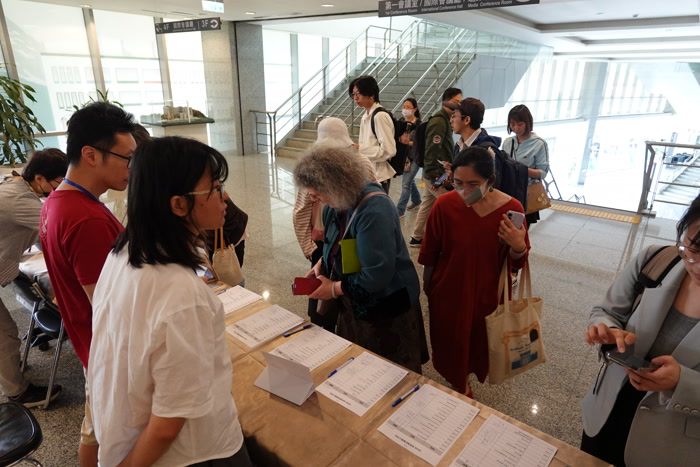
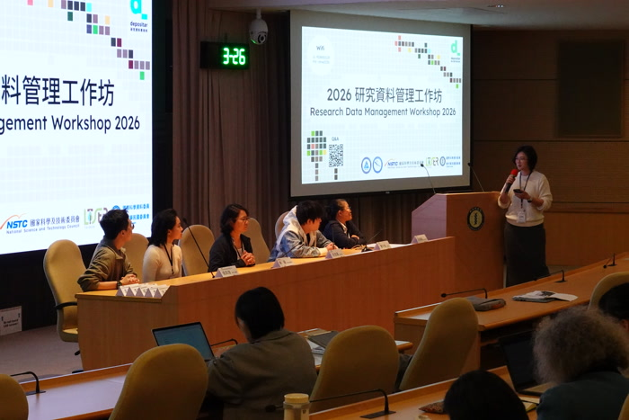
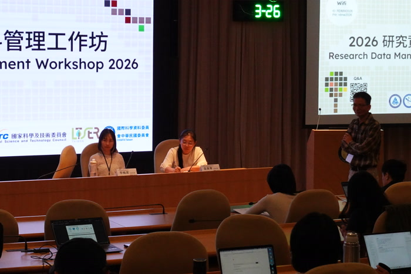
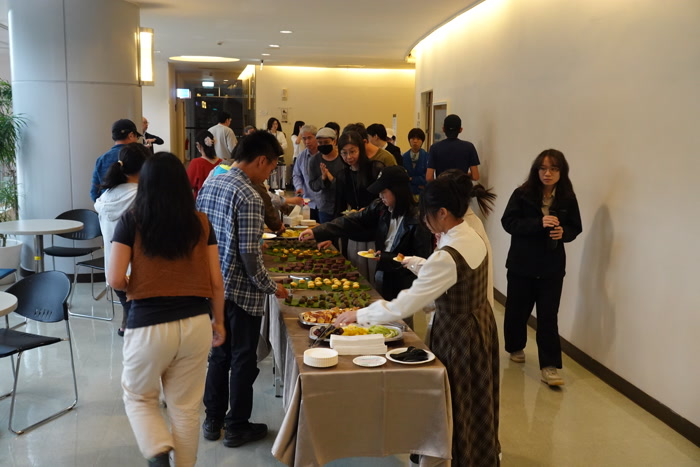

## 2026/3/26 週四 09:30-17:00

## 中央研究院人文社會科學館 第一會議室

 

可共享、可再次利用的研究資料，是科學發展的基石。而研究資料能否妥善釋出使用，取決於資料管理的工作是否紮實。在[開放科學漸受世界各國重視](https://www.unesco.org/en/open-science/about)的此刻，[研究資料管理](https://scienceeurope.org/our-priorities/open-science/research-data-management/)的重要性也正日益彰顯。「研究資料管理工作坊」曾於 [2021 年底](https://odw.tw/2021/)和 [2023 年底](https://2023.odw.tw/)兩次於台北中央研究院舉行，於一天的時間，密集進行資料管理實務和資料策略議題的交流討論。每次工作坊約有百人參加，參與者包括資料管理員、研究者、教師、學生、圖書館員、學術行政人員等。

2026 年研究資料管理工作坊，於三月 26 日再次於中央研究院舉行。除了主題演講，安排有「長期社會生態研究的資料管理實務」、「跨領域研究的資料管理」、以及「資料典藏、取用、與呈現」三項議程。我們邀請了十來位經驗豐富的專家學者與實務工作者，分享其經驗與看法。希望透過這樣的安排，可呈現並討論台灣在研究資料管理上的現況與前景、實踐方式，以及所遭遇的難題。

此工作坊系列由[研究資料寄存所實驗室 (depositar lab)](https://lab.depositar.io/) 籌辦，此實驗室位於中央研究院資訊科學研究所並受其經費支持，部份經費並來自中央研究院資訊科技創新研究中心以及國家科學及技術委員會（自然科學及永續研究發展處專題計畫）。該實驗室建置並經營[研究資料寄存所 (depositar)](https://data.depositar.io/) 以及[研究資料管理推進室 (Research Data Management Hub)](https://rdm.depositar.io/)。
## 活動照片
<table style="border-collapse: separate; border-spacing: 12px; border: none;">
  <tr>
    <td style="border: none;">
      
    </td>
    <td style="border: none;">
      
    </td>
    <td style="border: none;">
      
    </td>
    <td style="border: none;">
      
    </td>
  </tr>
  <tr>
    <td style="border: none;">
      
    </td>
    <td style="border: none;">
      
    </td>
    <td style="border: none;">
      
    </td>
    <td style="border: none;">
      
    </td>
  </tr>
</table>
